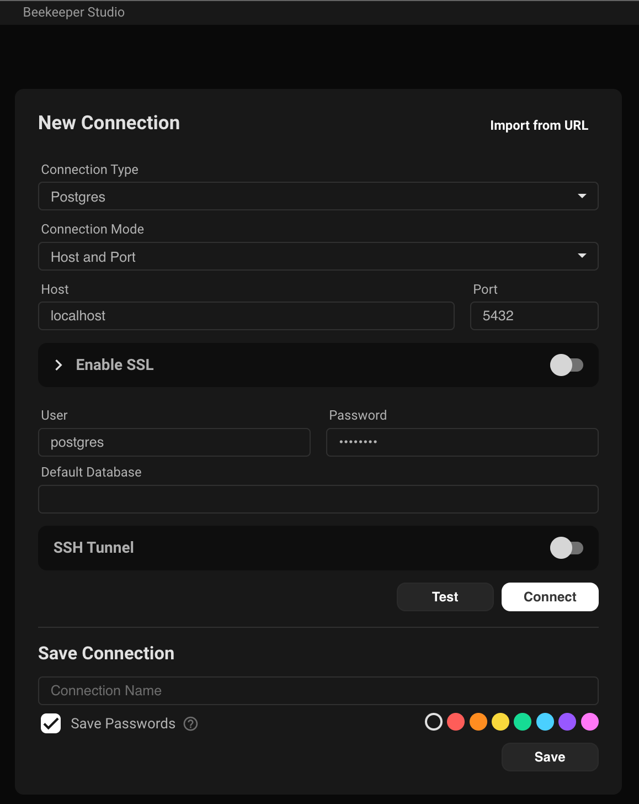
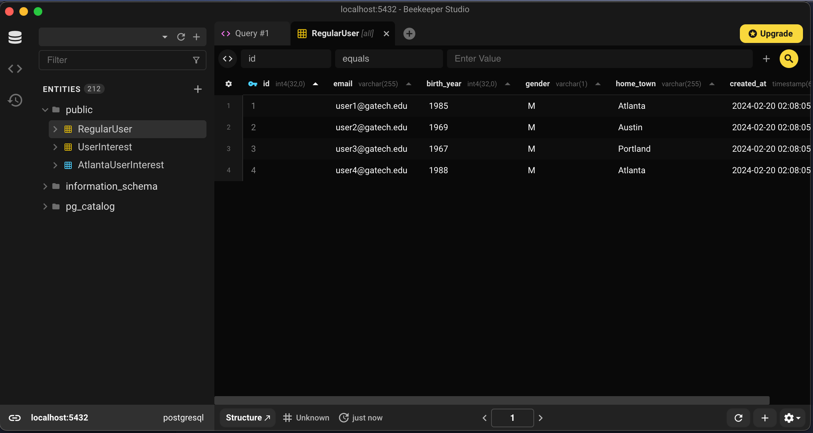
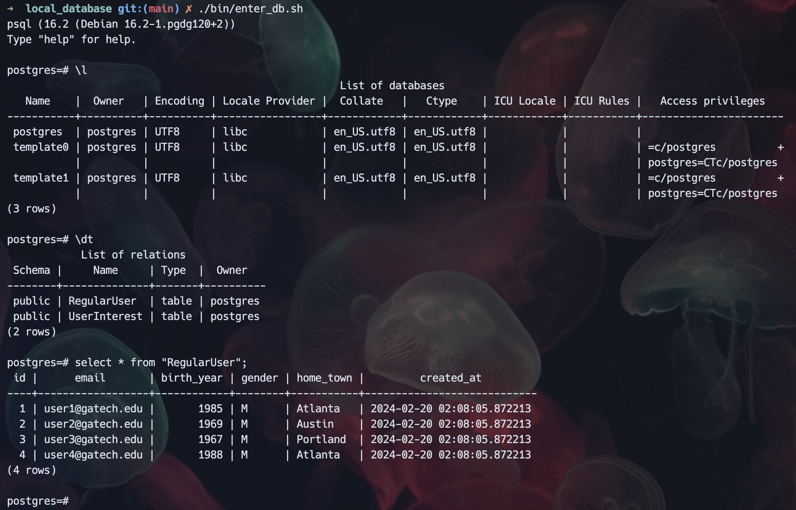

# Local Database Playground

### Notes
- All software I ask you to install is free for academic use
- I organized the directories in the following way:
    - `bin/` contains the executable shell scripts
    - `docs/` comtains the additional documentation files (they end in `.md`)
    - `res/` contains the additional resources like image files
    - `src/` contains the SQL files
        - `migrations/` contains the initialized on startup database SQL commands
        - `scripts/` comtains the on-the-fly, ad-hoc SQL commands  

### Setup
1. Install [docker](https://docs.docker.com/engine/install/)
2. Only If you are running on Windows OS
    1. Install [git bash](https://gitforwindows.org/)
    2. For all the following commands use the `git bash` terminal since it supports running scripts ending in `.sh`

### Running
1. Ensure docker is running
    - You should see a little whale in the taskbar  
    
    - You may have to search for and run `docker` in your installed local applications
2. Run the database docker container
```bash
./bin/start_db.sh
```
3. You can check the status of the docker container in the Docker Desktop application  
    

4. Once running, you can now connect to the database at [localhost:5432](localhost:5432).  
The database info can all be changed in the `bin/start_db.sh` file under `# Set local variables`.  
The current values are:
- `username: postgres`
- `port: 5432`
- `password: password`

5. (Optional) To connect to the local database there are the following applications you can use:
    - [BeeKeeper](https://www.beekeeperstudio.io/get)
        - Connecting to local DB
  
        - Viewing data inside DB



6. (Optional) For a command line into the database container
```bash
./bin/enter_db.sh
```


### Additional Documentation 
- [Postgres Commands](docs/Postgres_Commands.md)
- [SQL Commands](docs/SQL_Commands.md)
