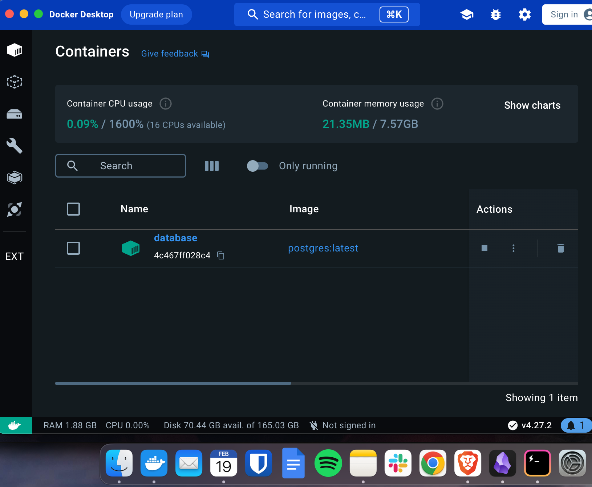
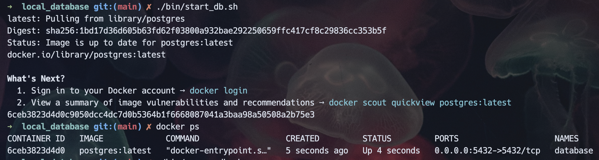
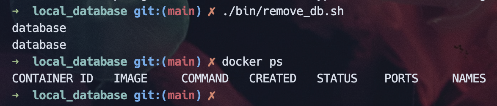

# Local Database Playground

## Notes
- All software I ask you to install is free for academic use
- I organized the directories in the following way
    - `bin/` contains the executable shell scripts
    - `docs/` contains the additional documentation files (they end in `.md`)
    - `res/` contains the additional resources like image files
    - `src/` contains the SQL files
        - `migrations/` contains the initialized on startup database SQL commands
        - `scripts/` contains the on-the-fly, ad-hoc SQL commands  

## Setup
1. Install [docker](https://docs.docker.com/engine/install/)
2. Only If you are running on Windows OS
    1. Install [git](https://gitforwindows.org/)
    2. For all the following commands use the `git bash` terminal since it supports running scripts ending in `.sh`

## Running
1. Ensure docker is running
    - You should see a little whale in the taskbar  
    
    - You may have to search for and run `docker` in your installed local applications
    - (Optional) You can check if docker is running from the following command
        ```bash
        docker ps
        ```
        - if you see an error that includes `Cannot connect to the Docker daemon`, then docker is not running locally

2. Run the database docker container
    ```bash
    ./bin/start_db.sh
    ```

3. Check the status of the database docker container

    - From the Docker Desktop application
          
    - OR from the following command in the terminal
        ```bash
        docker ps
        ```
          

4. Once running, you can now connect to the database at [localhost:5432](localhost:5432)
    - The database info can all be changed in the `bin/start_db.sh` file under the `Set local variables` comment.
    - The current database settings are:
        - `HOST = localhost`
        - `PORT = 5432`
        - `USERNAME = postgres`
        - `PASSWORD = password`

5. (Optional) To connect to the local database there are the following applications you can use
    - [BeeKeeper](https://www.beekeeperstudio.io/get)
        - Connecting to local DB
              
        - Viewing data inside DB
            


6. (Optional) To stop & remove the database docker container run
    ```bash
    ./bin/remove_db.sh
    ```
      

7. (Optional) If you want to make changes to the initialization of the database (`src/migrations/*.sh`), you will need to restart the database docker container
    ```bash
    ./bin/start_db.sh
    ```

6. (Optional) For a command line into the database container
    ```bash
    ./bin/enter_db.sh
    ```
    

## Additional Documentation 
- [Postgres Commands](docs/Postgres_Commands.md)
- [SQL Commands](docs/SQL_Commands.md)
